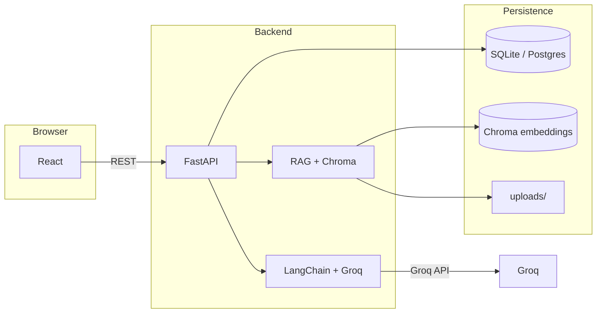

# GradeUp AI

RAG-based adaptive tutoring: PDF upload, grounded chat, AI quizzes, weakness analytics, and multi-model support (Groq). FastAPI backend, React (Vite) frontend, ChromaDB + sentence-transformers for retrieval.

**Repository:** [github.com/HassaanAfzal123/Gradeup-AI](https://github.com/HassaanAfzal123/Gradeup-AI)

## Features

- JWT auth, multi-user isolation  
- PDF → chunk → embed → ChromaDB  
- RAG chat and optional adaptive tutoring context  
- Quiz generation (multiple Groq models), grading, concept tracking  
- Analytics / evaluation API; experimental notebook under `experiments/`  
- Prompts documented in `prompts.txt`  
- Docker Compose stack (backend + frontend)

## Tech stack

| Layer | Choices |
|--------|---------|
| API | FastAPI, Uvicorn |
| DB | SQLite (default) or PostgreSQL via `DATABASE_URL` |
| Vectors | ChromaDB (persistent client, per-user collections) |
| LLM | Groq (Llama 3.3 70B, Llama 4 Scout, Llama 3.1 8B, etc.) |
| Embeddings | `sentence-transformers/all-MiniLM-L6-v2` |
| Orchestration | LangChain (quiz / agents) |
| UI | React 18, Vite, Tailwind, Axios |

## Prerequisites

- Python **3.11+** recommended  
- Node **18+**  
- **Groq API key** — [console.groq.com](https://console.groq.com/)  
- For Docker: **Docker Desktop**

## Course submission bundle (`GenAI_Code/`)

To produce a **minimal code folder** for your ZIP (no `.venv`, no `node_modules`, no secrets):

```powershell
.\scripts\build-genai-code-folder.ps1
```

This creates **`GenAI_Code\`** in the repo root. Add your **PDF report** if required, then zip **per instructor naming** (e.g. `ROLLNO NAME.ZIP`).  
`GenAI_Code\` is listed in `.gitignore` so it is not committed; the full repo stays the source of truth.

## Local development

### Backend

```powershell
cd backend
copy .env.example .env
# Edit .env: GROQ_API_KEY, SECRET_KEY, DATABASE_URL (see .env.example)
python -m venv .venv311
.\.venv311\Scripts\Activate.ps1
pip install -r requirements.txt
python -m uvicorn main:app --host 127.0.0.1 --port 8000 --reload
```

- API: `http://127.0.0.1:8000` — OpenAPI: `/docs`  
- SQLite example: `DATABASE_URL=sqlite:///./gradeup.db`  
- First import may download the embedding model (slow on poor networks).

### Frontend

```powershell
cd frontend
npm install
npm run dev
```

- App: `http://localhost:5173`  
- Dev API base: `frontend/.env.development` → `http://localhost:8000/api`  
- Ensure `CORS_ORIGINS` in `backend/.env` includes `http://localhost:5173` and `http://127.0.0.1:5173` if you switch hosts.

### Run tests

```powershell
cd backend
pytest tests -v
```

## Docker

Use **Compose from the repo root** (do not rely on “Run” on a single image in Docker Desktop; service name `backend` must exist on the Compose network).

1. Create `backend/.env` (copy from `.env.example`) with real **`GROQ_API_KEY`** and **`SECRET_KEY`**.  
2. Compose overrides **`DATABASE_URL`** and **`CHROMA_PERSIST_DIR`** for paths inside containers and uses **named volumes** (separate DB/Chroma/uploads from your local folders).

```powershell
cd <repo-root>
docker compose build backend
docker compose up -d
```

Or:

```powershell
.\scripts\docker-start.ps1
```

- UI: `http://localhost:5173`  
- API: `http://localhost:8000`  
- **First boot** can take **15–30+ minutes** while the embedding model downloads; later starts are faster (Hugging Face cache volume).  
- **Accounts created locally do not exist in Docker** until you register again (different SQLite file / volume).

## Project layout

```
├── backend/           # FastAPI app (routers, services, auth, tests)
├── frontend/          # Vite + React
├── experiments/       # evaluation_notebook.ipynb, plots
├── scripts/           # docker-start.ps1, docker-fresh.ps1
├── prompts.txt       # system / quiz prompts (for rubric / reproducibility)
├── docker-compose.yml
└── docs/              # paper assets (e.g. overleaf-final/, .bib, figures) — not extra READMEs
```

## Architecture (high level)



## API overview

- `POST /api/auth/register`, `POST /api/auth/login`, `GET /api/auth/me`  
- PDF: `POST /api/pdf/upload`, list, delete, summarize  
- Chat: `POST /api/chat/ask`, history  
- Quiz: generate, submit, history  
- Analytics / evaluation endpoints under `/api/analytics`, `/api/evaluation`  
- Health: `GET /health`

Full detail: **`/docs`** when the backend is running.

## Troubleshooting

| Issue | What to check |
|--------|----------------|
| Backend won’t start | `backend/.env` present; required vars set; `docker compose logs backend` |
| Login works locally but not in Docker | Expected: Docker uses its own DB volume — register a user in that environment |
| Frontend 400 on OPTIONS / login | CORS: add your exact `Origin` (localhost vs 127.0.0.1) to `CORS_ORIGINS` |
| Nginx `upstream backend` | Start stack with **`docker compose up`**, not isolated image Run |
| Docker build `files.pythonhosted.org` errors | Network/DNS; retry on stable connection; see `backend/Dockerfile` pip retries |
| Compose “unhealthy” too soon | First model load is long; `docker-compose.yml` uses extended `start_period`; watch `docker compose logs -f backend` |

## License

MIT — suitable for learning and demos; ensure compliance with Groq, model, and data-use terms in production.
